 

<!-- HEADER SECTION -->
<h5 align="center" style="padding:0;margin:0;">Mariné du Plessis</h5>
<h5 align="center" style="padding:0;margin:0;">221326</h5>
<h6 align="center">Creative Production 410 (Interactive Development)</h6>
 

  <a href="https://github.com/username/projectname">
    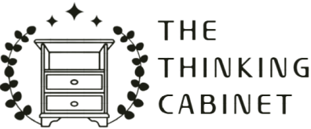
  </a>
  
  <h3 align="center">The Thinking Cabinet</h3>

  

    Your AI-powered Wunderkammer of curiosity and reflection.  
    
    <a href="https://github.com/DupieM/DuPlessisMarine_221326_The_Thinking_Cabinet/issues">Report Bug</a>
    ·
    <a href="https://github.com/DupieM/DuPlessisMarine_221326_The_Thinking_Cabinet/issues">Request Feature</a>

<!-- TABLE OF CONTENTS -->
## Table of Contents

* [About the Project](#about-the-project)
  * [Project Description](#project-description)
  * [Built With](#built-with)
* [Getting Started](#getting-started)
  * [Prerequisites](#prerequisites)
  * [How to install](#how-to-install)
* [Features and Functionality](#features-and-functionality)
* [Concept Process](#concept-process)
   * [Ideation](#ideation)
   * [Wireframes](#wireframes)
   * [User-flow](#user-flow)
   * [ERD](#erd-diagram)
* [Development Process](#development-process)
   * [Implementation Process](#implementation-process)
        * [Highlights](#highlights)
        * [Challenges](#challenges)
   * [Reviews and Testing](#peer-reviews)
        * [Reviews](#feedback-from-reviews)
        * [Unit Tests](#unit-tests)
        * [UAT Tests](#uat-tests)
   * [Future Implementation](#peer-reviews)
* [Final Outcome](#final-outcome)
    * [Mockups](#mockups)
    * [Video Demonstration](#video-demonstration)
    * [Promotional Video](#promotional-video)
* [Roadmap](#roadmap)
* [Contributing](#contributing)
* [License](#license)
* [Contact](#contact)
* [Acknowledgements](#acknowledgements)

<!--PROJECT DESCRIPTION-->
## About the Project
<!-- header image of project -->
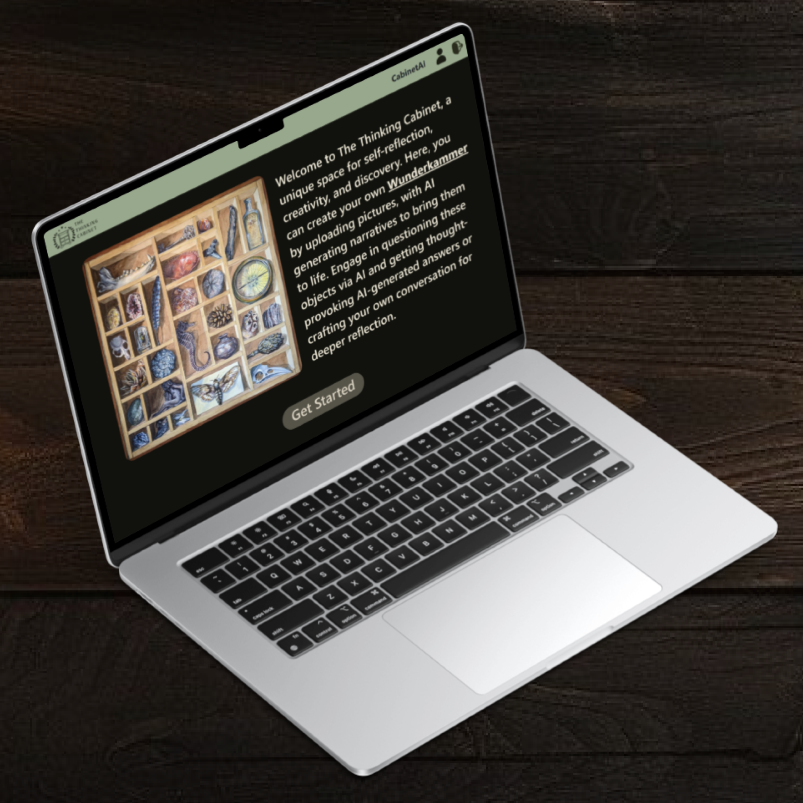

### Project Description

The Thinking Cabinet is an interactive digital platform in the form of a web application that fosters reflective thinking and self-exploration. Users can upload meaningful object images in their Wunderkammer and then engage with AI to explore their significance within a narrative chosen for a specific genre by the user. Thought-provoking responses can then be generated from predefined questions towards AI or the user can engage with AI by asking their own questions. These AI-driven conversations will lead to inspiration, reflection, or satisfying one’s own curiosity.

### Built With

* 
* 
* 
* 
* 

<!-- GETTING STARTED -->
<!-- Make sure to add appropriate information about what prerequesite technologies the user would need and also the steps to install your project on their own mashines -->
## Getting Started

The following instructions will get you a copy of the project up and running on your local machine for development and testing purposes.

### Prerequisites

For development, you require to create an account on [Firebase](https://firebase.google.com/).

## How to install

### Installation
Clone the project repository as follow:

1. Go to Github Desktop and then click on clone new repository

2. Enter `https://github.com/DupieM/DuPlessisMarine_221326_The_Thinking_Cabinet.git` into the URL field and press the `Clone` button.

To start the React app do the following steps:

1. Go to Visual Studio Code   
   Open your Visual Studio Code then click on File and then click on Open folder.
    Then navigate to where you have cloned the repository and open it.

2. Start terminal  
   Go to `Terminal` then click on new terminal.

3. Install dependencies  
   Enter `npm install` to get all the dependencies

4. Create your own .env file  
    Depending on the AI technology you are using (Google/OpenAI) add your `Private Keys` that you generated on either technology to this file.

5. Start the React App  
   Enter `npm start` to start 

<!-- FEATURES AND FUNCTIONALITY-->
<!-- You can add the links to all of your imagery at the bottom of the file as references -->
## Features and Functionality

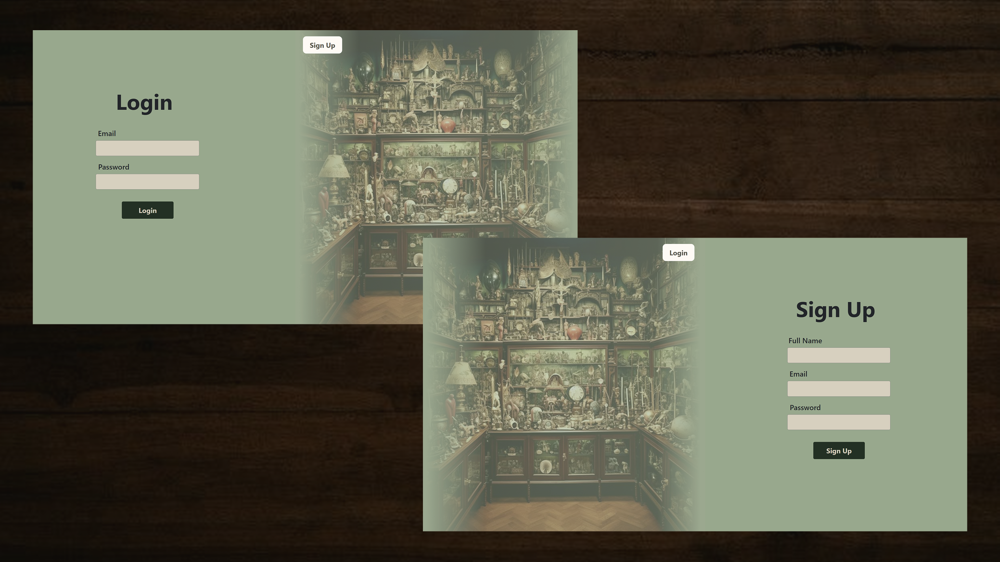
### Authentication Page

This page allows users to securely sign up with their name, email, and password or log in with their existing credentials. It includes client-side validation to ensure proper email formatting and password strength, and provides instant feedback for invalid input. Users are redirected to the home screen upon successful login or registration.

 

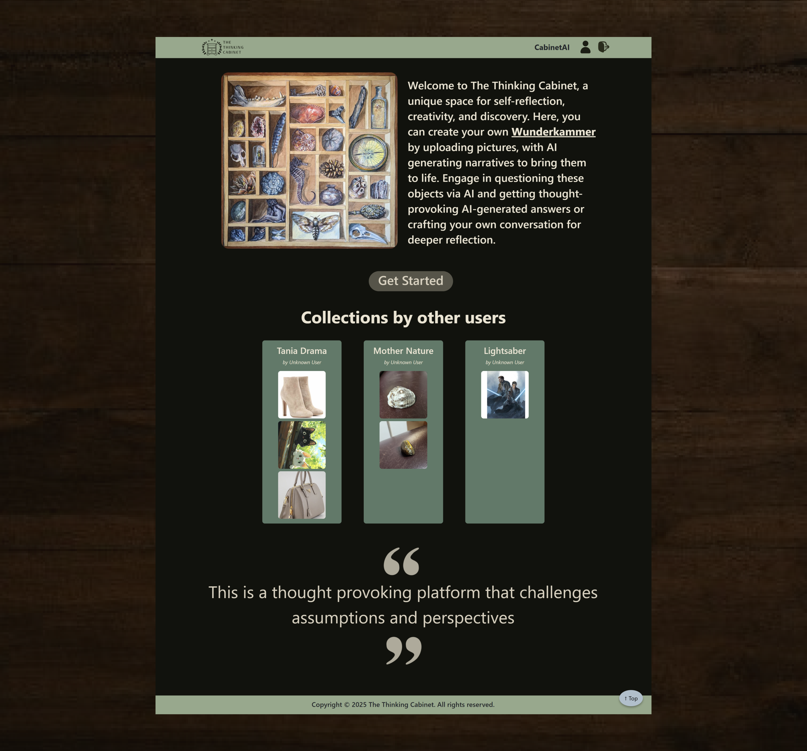

### Home Page

This page welcomes users with an introductory message and explains the concept of the Wunderkammer, a personalized cabinet of curiosities where users can upload images and generate AI-powered narratives. It also showcases a curated selection of collections created by other users, fostering inspiration while providing easy navigation to start creating your own collection.

 

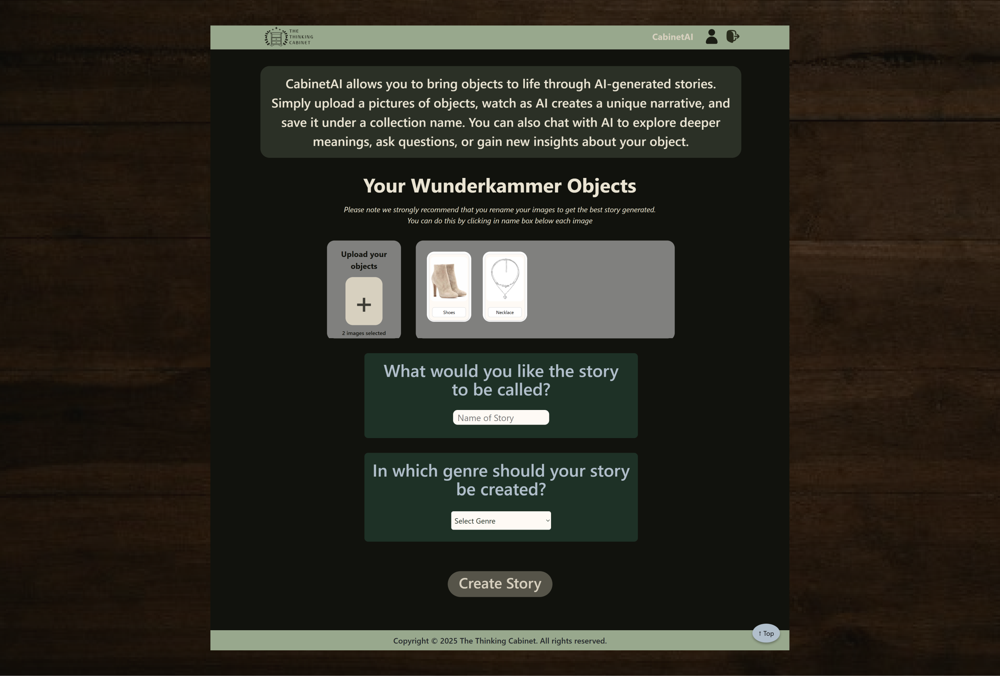

### CabinetAI Page One

This page lets users upload images of their objects to build a “Wunderkammer” collection. Users must rename each image to help the AI generate better, more personalized stories. They then provide a story title and select a genre from a dropdown. Upon clicking "Create Story," this data (user ID, story name, genre, images) is saved in shared state and the user is navigated to the next step (/cabinetAI-post) to generate AI narratives for their collection.

 

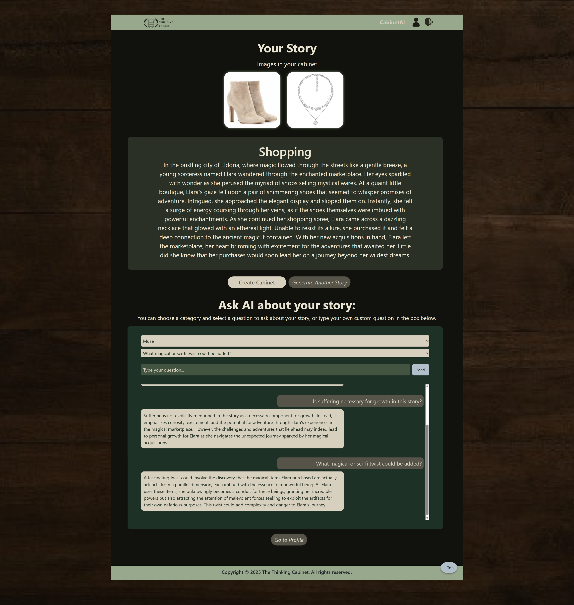

### CabinetAI Page Two

This page allows users to view the generated AI-written story based on their chosen genre and uploaded images. Users can interact with an AI assistant to ask questions about the story, save their story and images as a collection (“cabinet”) for later access, and navigate to their profile to review saved content. The page also supports regenerating stories and provides a categorized question prompt system to facilitate deeper story exploration.

 

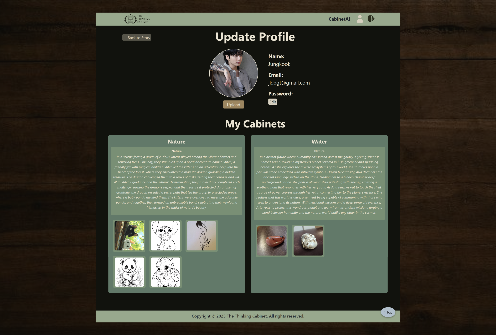

### Profile Page

This page allows users to view and update their personal information including their password and profile picture. They can securely change their password after re-authenticating, and browse through their personal Cabinets containing collections of images and stories. This page provides a centralized hub for managing account details and exploring user-created content.

<!-- CONCEPT PROCESS -->
<!-- Briefly explain your concept ideation process -->
## Concept Process

The `Conceptual Process` is the set of actions, activities and research that was done when starting this project.

### Ideation

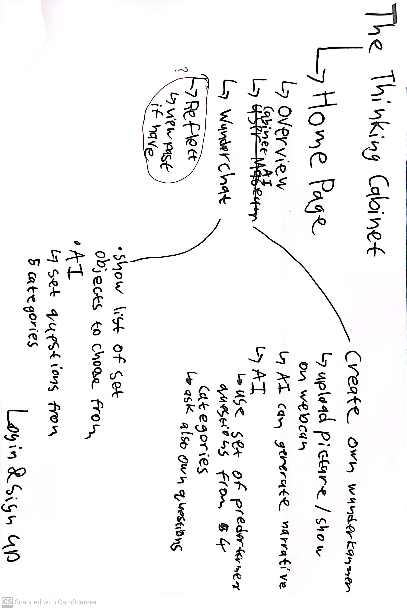
 
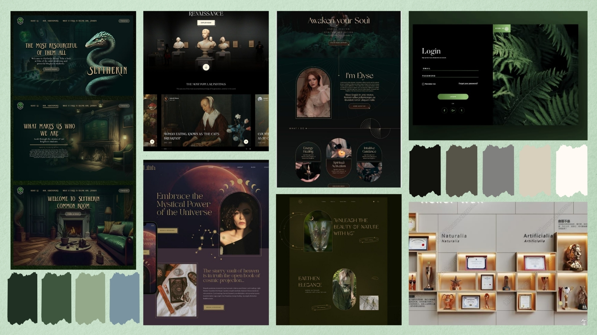

### Planned Wireframes

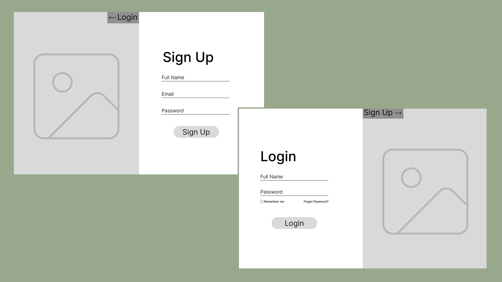
 
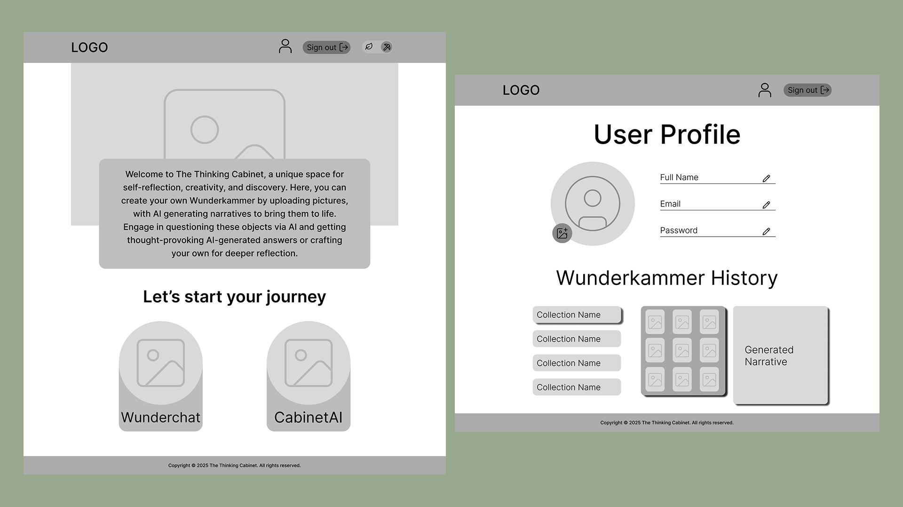
 
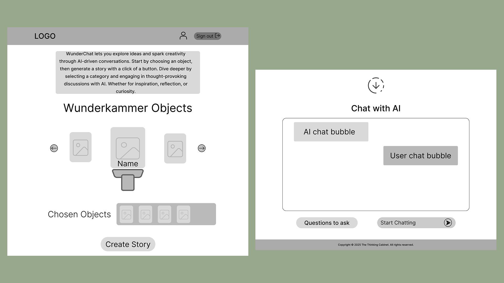
 
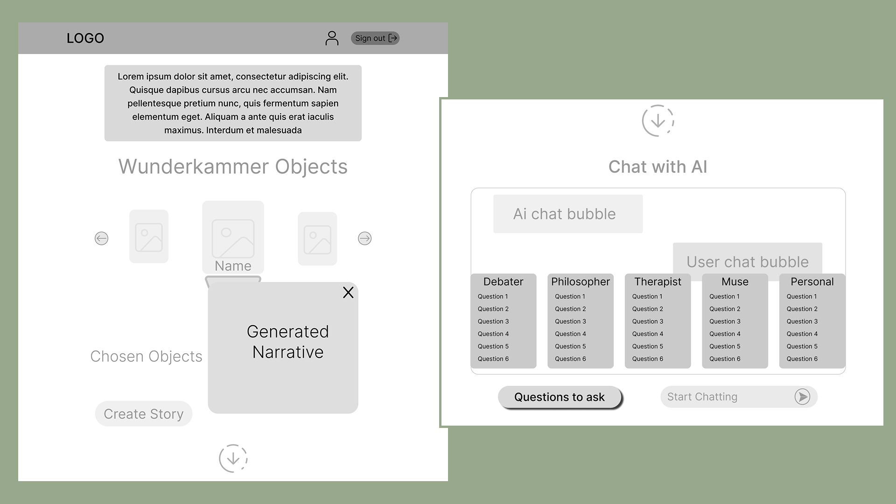

### User-flow

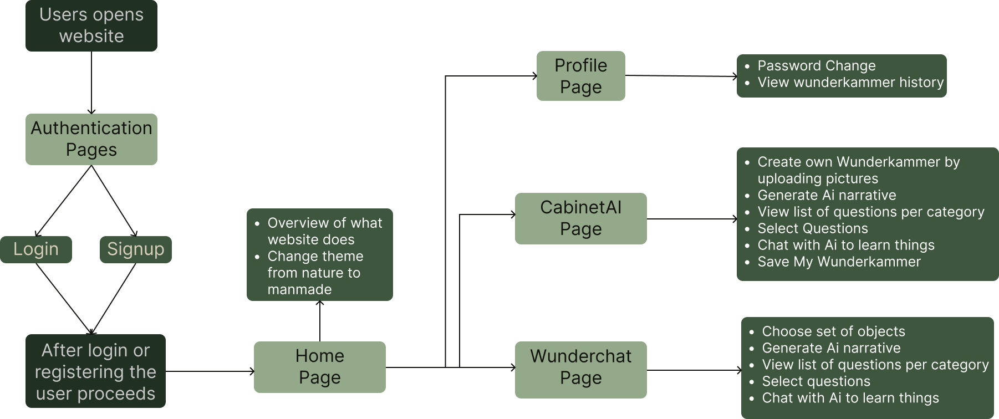

### Schema Diagram

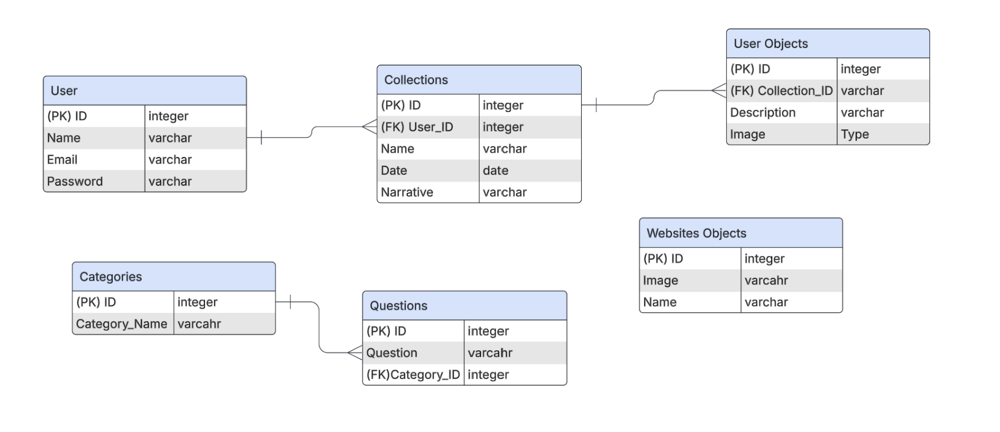

<!-- DEVELOPMENT PROCESS -->

## Development Process

The `Development Process` is the technical implementations and functionality done in the frontend and backend of the application.

### Implementation Process
<!-- stipulate all of the functionality you included in the project -->

* `OpenAI` was used to generate the story and to be able to chat with AI
* `React` was use to create the website
* `Firebase` was used to store all data

#### Highlights
<!-- stipulated the highlight you experienced with the project -->
* To be able to implement the chat function with AI to talk about the story that it generated
* To be able to let the user update their password by creating a new one
* To be able to let the user upload their own images (profile and objects) and to then save it in the database

#### Challenges
<!-- stipulated the challenges you faced with the project and why you think you faced it or how you think you'll solve it (if not solved) -->
* Allowing the user to upload a pictures to the website and then save it to AFirebase
* Saving data locally as to be able to display it on the next page
* Interfacing with OpenAI while managing the page respone and displaying the right content

### Reviews & Testing
<!-- stipulate how you've conducted testing in the form of peer reviews, feedback and also functionality testing, like unit tests (if applicable) -->
#### Unit Tests

`Unit Tests` were conducted to establish working functionality by myself.

* `Test 1` of authentication to make sure that username and password validation works and that the sign up and log in function works
* `Test 2` of confirming that displaying of cabinets of other users work
* `Test 3` of confirming that the upload of images and renaming works and displaying of images in a carousel
* `Test 4` of confirming that the OpenAi call works to generate story and to chat with AI
* `Test 5` of confirming that the update of new password works and is being saved
* `Test 6` of confirming that cabinets of current user displays with all the relevant data

#### UAT Tests

`User Acceptance Testing` were conducted to establish working functionality by my peers.

* `Peer One` did a unit test of the whole website and helped me by pointing out how to fix my UI designs to make it more user friendly
* `Peer TWo` did a unit test to test if all the functionality was working perfectly.

### Future Implementation
<!-- stipulate functionality and improvements that can be implemented in the future. -->

* To allow the user to add more images on the CabinetAI Page Two and then generate a new story and also a new cabinet.
* To enhance the loaders as for the loader to look like a cabinet that is moving.

<!-- MOCKUPS -->
## Final Outcome

### Mockups

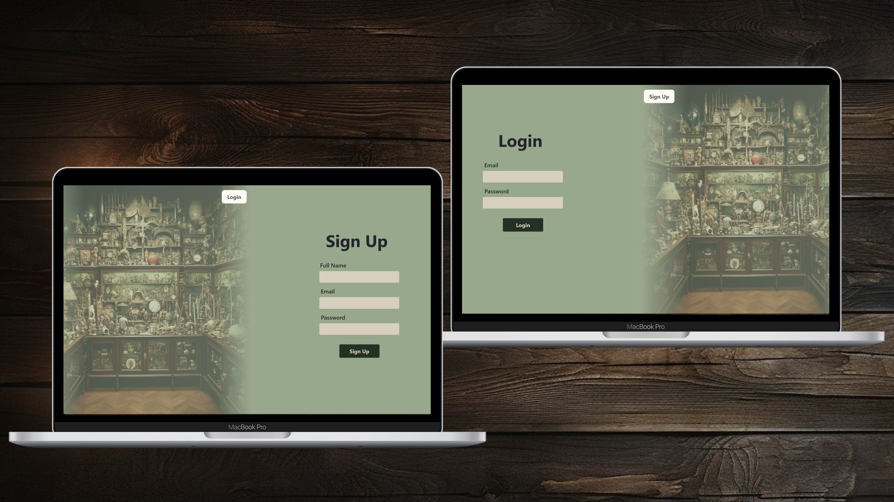
 

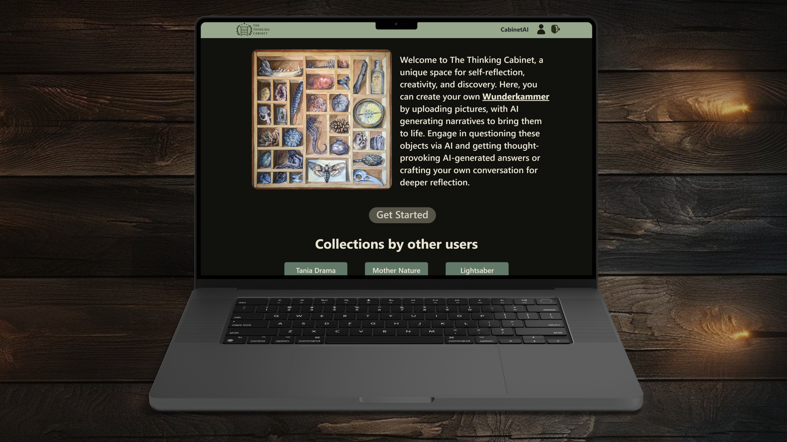
 

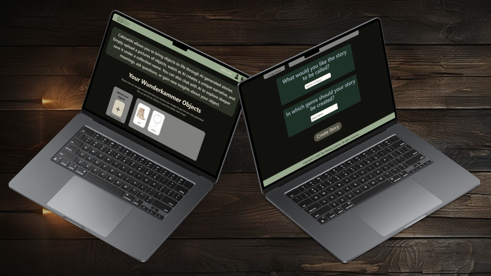
 

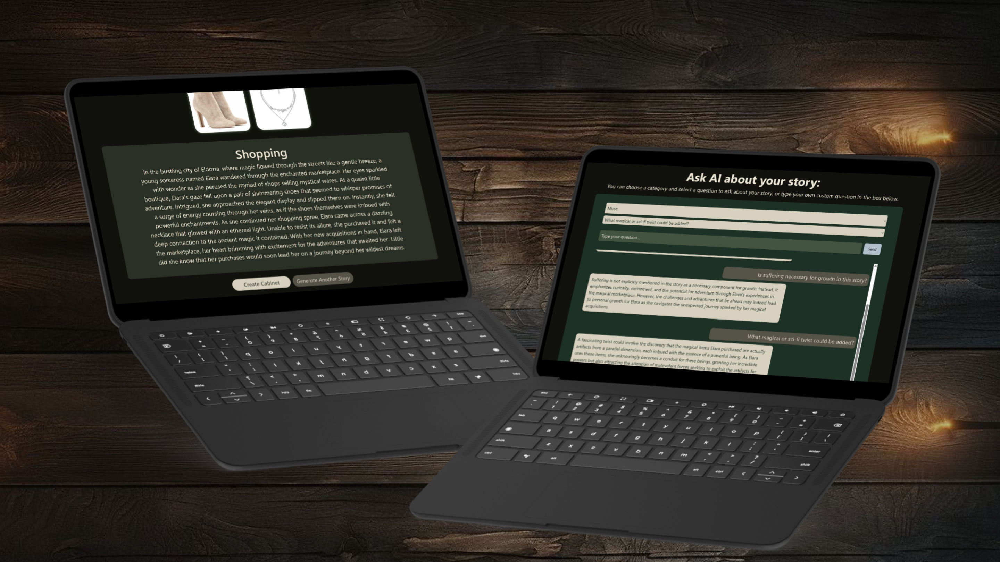
 

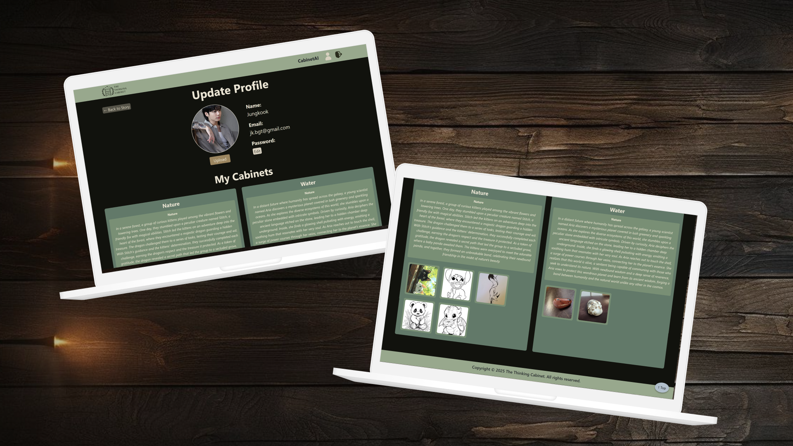
 

<!-- VIDEO DEMONSTRATION -->
### Video Demonstration

To see a run through of the application, click below:

[View Demonstration](https://drive.google.com/file/d/1oFMyl82BJvQ00KNKezDFxrbLbxhulAGY/view?usp=sharing)

### Promotional Video

[Promo Video](https://drive.google.com/file/d/1SvUdn86kQIHKWUNLxVaMFvwehxWjDclc/view?usp=sharing)

<!-- ROADMAP -->
## Roadmap

See Future Implementation for a list of proposed features (and known issues).

<!-- CONTRIBUTING -->
## Contributing

Contributions are what makes the open-source community such an amazing place to learn, inspire, and create. Any contributions you make are **greatly appreciated**.

1. Fork the Project
2. Create your Feature Branch (`git checkout -b feature/AmazingFeature`)
3. Commit your Changes (`git commit -m 'Add some AmazingFeature'`)
4. Push to the Branch (`git push origin feature/AmazingFeature`)
5. Open a Pull Request

<!-- AUTHORS -->
## Authors

* **Mariné du Plessis** - [username](https://github.com/DupieM)

<!-- LICENSE -->
## License

The Thinking CAbinet Rights reserved © 2025

<!-- LICENSE -->
## Contact

* **Mariné du Plessis** - [email@address](221326@virtualwindow.co.za) 
* **Project Link** - https://github.com/DupieM/DuPlessisMarine_221326_The_Thinking_Cabinet

<!-- ACKNOWLEDGEMENTS -->
## Acknowledgements
<!-- all resources that you used and Acknowledgements here -->
* [Firebase Documentation](https://firebase.google.com/docs?hl=en&authuser=1&_gl=1*oj3ulf*_ga*MTQzMDEzOTU3OS4xNzEyNTU2NTU1*_ga_CW55HF8NVT*MTcxODU1NTAxMS44NS4xLjE3MTg1NTgxMDAuNTkuMC4w)
* [OpenAi Documentation](https://platform.openai.com/docs/concepts)
